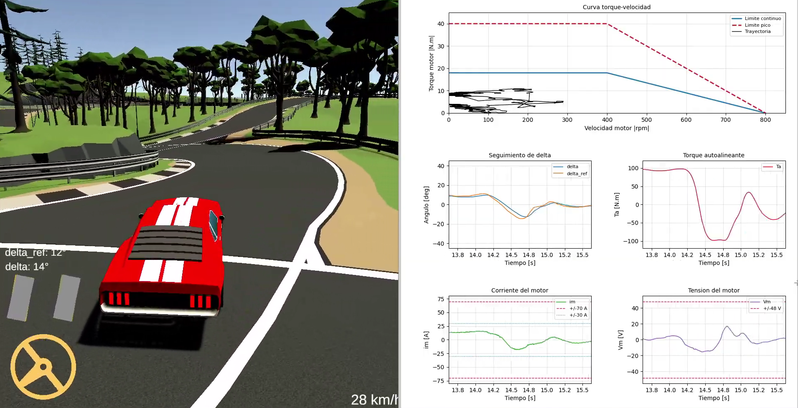

# Steering by Wire - Control y Simulacion

Proyecto de modelado, control y validacion de un sistema de direccion por cable (*steering by wire*) para el lado de actuacion de las ruedas. El trabajo incluye el modelo dinamico en espacio de estados, el diseno de control LQR, observador de estados, modelado de sensor de cremallera, perturbaciones, validacion del actuador y pruebas con visualizacion en Unity.

## Estructura del proyecto

- `Informe_CyS_SteeringByWire/`: informe principal en LaTeX y figuras utilizadas.
- `Simulink/`: modelo dinamico y simulaciones en MATLAB/Simulink.
- `Papers/`: bibliografia tecnica utilizada como referencia.
- `python scripts/`: herramientas de visualizacion en tiempo real por UDP.
- `Anteproyecto/`: documentacion preliminar del proyecto.

La carpeta `Build Unity Steering by Wire/` contiene una build local de Unity y queda excluida de Git por su tamano. Para compartirla conviene subir un archivo comprimido como *GitHub Release* o mediante un enlace externo.

## Informe

El informe principal se encuentra en:

```text
Informe_CyS_SteeringByWire/Informe_Steering_By_Wire.tex
```

Para compilarlo desde la carpeta del informe:

```bash
cd Informe_CyS_SteeringByWire
latexmk -pdf Informe_Steering_By_Wire.tex
```

El PDF generado es:

```text
Informe_CyS_SteeringByWire/Informe_Steering_By_Wire.pdf
```

## Simulacion

El modelo principal de MATLAB/Simulink esta en:

```text
Simulink/Modelo_SS.m
Simulink/Modelo_SS_Simulink.slx
```

El script `Modelo_SS.m` define los parametros de la planta, el actuador, el controlador LQR, el observador y las constantes usadas por el modelo de Simulink.

## Visualizacion por UDP

Los scripts de Python permiten recibir datos enviados desde Simulink por UDP y graficar en tiempo real variables como velocidad del motor, torque, tension, corriente, angulo de rueda y torque autoalineante.

Instalacion recomendada en entorno virtual:

```bash
python3 -m venv .venv
source .venv/bin/activate
python -m pip install -r "python scripts/requirements.txt"
```

Ejemplo de ejecucion:

```bash
python "python scripts/udp_motor_dashboard.py"
```

## Unity

La escena de Unity se utiliza para validar cualitativamente el comportamiento del modelo con entradas reales y comunicacion UDP desde Simulink. El angulo de direccion calculado en Simulink se aplica sobre el modelo fisico del vehiculo en Unity.



La build exportada no se versiona en Git porque contiene archivos grandes que superan el limite de GitHub.
